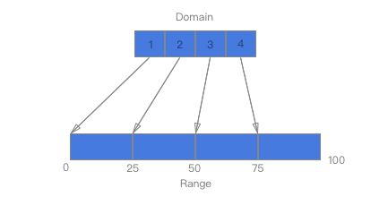

# 数据可视化作业五：D3.js可视化库的使用

[D3.js - 快速指南](https://iowiki.com/d3js/d3js_quick_guide.html)

--------

- 注意！在引入本地或动态的d3库时应使用如下语句（type必须要加，且不可以直接是javascript，而应是text/javascript）：

```javascript
<script type="text/javascript" src="../static/JSLib/d3.min.js" charset="utf-8"></script>
```


## 1 可放缩矢量图形SVG (*Scalable Vector Graphics*)

- SVG是一种在网页上呈现图像的方法。 SVG不是直接图像，而只是使用文本创建图像的一种方式。 顾名思义，它是一个**Scalable Vector** 。 它会根据浏览器的大小进行缩放，因此调整浏览器大小不会使图像失真。 除IE 8及更低版本外，所有浏览器均支持SVG。 数据可视化是可视化表示，使用SVG使用D3.js渲染可视化很方便。
  - SVG是基于矢量的图像格式，它是基于文本的
  - SVG在结构上与HTML类似
  - SVG可以表示为**Document object model**
  - 可以将SVG属性指定为属性
  - SVG应该具有相对于原点（0,0）的绝对位置
  - SVG可以包含在HTML文档中
- 将SVG视为画布，我们可以在其上绘制不同的形状。 首先，让我们创建一个SVG标记：

```javascript
<svg width = "500" height = "500"></<svg>
```

- svg的默认测量值是像素，因此我们不需要指定单位是否为像素。现在，如果我们想绘制一个矩形，我们可以使用下面的代码绘制它：

```javascript
<svg width = "500" height = "500">
   <rect x = "0" y = "0" width = "300" height = "200"></rect>
</svg>
```

- 我们可以在SVG中绘制其他形状，如直线，圆，椭圆，文本和路径。就像样式化HTML元素一样，样式化SVG元素很简单。 我们将矩形的背景颜色设置为黄色。 为此，我们需要添加一个属性“fill”并将值指定为黄色，如下所示：

```javascript
<svg width = "500" height = "500">
   <rect x = "0" y = "0" width = "300" height = "200" fill = "yellow"></rect>
</svg>
```

---------


- **D3.js创建SVG的步骤**：

  - Step 1. 创建一个容器来保存SVG图像：

  ```javascript
  <div id = "svgcontainer"></div>
  ```

  - Step 2. 使用select() 方法选中容器，并使用append() 方法注入SVG元素，再使用attr() 或者style() 的方法添加属性和样式，即设置幕布样式：

  ```javascript
  var width = 300;
  var height = 300;
  var svg = d3.select("#svgcontainer")
     .append("svg").attr("width", width).attr("height", height);
  ```

  - Step 3. 再SVG元素中添加line等具体的图形元素：

  ```javascript
  svg.append("line")
     .attr("x1", 100)
     .attr("y1", 100)
     .attr("x2", 200) 
     .attr("y2", 200)
     .style("stroke", "rgb(255,0,0)")
     .style("stroke-width", 2);
  ```

  ​	除了**line**之外，还有**矩形元素rect**、**圆元素circle**、**椭圆元素ellipse**等

----------


- **SVG转换** (*SVG Transformation*)

  - SVG引入了一个新属性， **transform**为支持转换。 可能的值是以下一项或多项
    - **Translate** - 它有两个选项， **tx**沿x轴平移， **ty**沿y轴平移。 例如：transform (30 30)
    - **Rotate** - 它有三个选项， **angle**指旋转角度， **cx**和**cy**指的是x和y轴旋转的中心。 如果未指定**cx**和**cy** ，则默认为坐标系的当前原点。 例如：rorate (60)
    - **Scale** - 它有两个选项， **sx**沿x轴的比例因子， **sy**沿y轴的比例因子。 这里， **sy**是可选的，如果没有指定，则它取**sx**的值。 例如：scale (10)
    - **Skew (SkewX and SkewY)** - 只需一个选项， **skew-angle**指的是SkewX沿x轴的角度和SkewY沿y轴的角度。 例如：skewx (20)

  ```html
  <html>
     <head>
        <script type = "text/javascript" src = "https://d3js.org/d3.v4.min.js"></script>
     </head>
     <body>
        <svg width = "300" height = "300">
           <rect x = "20" 
              y = "20"
              width = "60"
              height = "60"
              fill = "green"
              transform = "translate(30 30) rotate(45)">
           </rect>
        </svg>
     </body>
  </html>
  ```

  - 转换也可应用于**SVG组元素**，这使得能够转换SVG中定义的复杂图形：

  ```html
  <html>
     <head>
        <script type = "text/javascript" src = "https://d3js.org/d3.v4.min.js"></script>
     </head>
     <body>
        <svg width = "300" height = "300">
           <g transform = "translate(60,60) rotate(30)">
              <rect x = "20" 
                 y = "20" 
                 width = "60" 
                 height = "30" 
                 fill = "green">
              </rect>
              <circle cx = "0" 
                 cy = "0" 
                 r = "30" 
                 fill = "red"/>
           </g>
        </svg>
     </body>
  </html>
  ```

  ​	组元素可以如下定义：

  ```javascript
  var group = svg.append("g").attr("transform", "translate(60, 60) rotate(30)");
  ```

  ​	之后再创建SVG图形即可以通过以下方式将其附加到组中：

  ```javascript
  var rect = group
     .append("rect")
     .attr("x", 20)
     .attr("y", 20)
     .attr("width", 60)
     .attr("height", 30)
     .attr("fill", "green")
  ```

  - **D3变换库** (*D3 Transform Library*)

    - D3.js提供了一个单独的库来管理转换，而无需手动创建转换属性。 它提供了处理所有类型转换的方法。 一些方法是**transform(), translate(), scale(), rotate()**等

    ```html
    <script src = "d3-transform.js"></script>
    ```

    - 转换代码可以写成：

    ```javascript
    var my_transform = d3Transform()
       .translate([60, 60])
       .rotate(30);
    var group = svg
       .append("g")
       .attr("transform", my_transform);
    ```

    


---------


## 2 Selections in D3.js

- 选择是D3.js的核心概念之一。 它基于CSS选择器。 它允许我们选择网页中的一个或多个元素。 此外，它允许我们修改，追加或删除与预定义数据集相关的元素。 在本章中，我们将了解如何使用选择来创建数据可视化。

- D3.js有助于使用以下两种方法从HTML页面中选择元素：

  - **select()** - 通过匹配给定的CSS选择器，**仅选择一个DOM元素**。 如果给定的CSS选择器有多个元素，则仅选择第一个元素。
  - **selectAll()** - 通过匹配给定的CSS选择器来**选择所有DOM元素**。 如果您熟悉使用jQuery选择元素，则D3.js选择器几乎相同。

- **select()方法**：

  - 可以通过html元素的标记、类名class和ID来访问元素

    - `d3.select("div")`为选择标记
    - `d3.select(".myclass")`为选择类
    - `d3.select("#test")`为选择id

  - **d3.select("div.myTest").append("span")**：在div标签内添加一个新的标签span

  - **d3.select("div.myTest").append("span").text("from D3.js!")**：text（）方法用于设置所选/附加元素的内容

    相同的脚本也可以在没有链语法的情况下访问：

    ```javascript
    var body = d3.select("div.myclass");
    var span = body.append("span");
    span.text("from D3.js");
    ```

- **selectAll()方法**：
  - selectAll（）方法用于选择HTML文档中的多个元素。 select方法选择第一个元素，但selectAll方法选择与特定选择器字符串匹配的所有元素。 如果选择匹配none，则 *selectAll()* 方法会创建一个空选择集并返回。 我们也可以在 *selectAll()* 方法中链接所有附加的修改方法， **append(), html(), text(), attr(), style(), classed(),**等。 在这种情况下，方法将影响所有匹配元素。
  - 修改元素的方法将影响到所有被选中的元素。

-------


## 3 D3.js 修改元素

- D3.js提供了各种方法来修改所选元素的内容和样式

- **html()方法**：

  - 用于设置所选/附加元素的html内容

- **attr()方法**：

  - 用于添加或更新所选元素的属性

    ```javascript
    d3.select("div.myTest").attr("style", "color: red");
    ```

- **style()方法**：

  - 用于添加或更新所选元素的样式

    ```javascript
    d3.select("div.myTest").style("color", "red");
    ```

- **classed()方法**：

  - 专门用于设置HTML元素的“class”属性。 因为，单个HTML元素可以有多个类; 在为HTML元素分配类时，我们需要小心。 此方法知道如何处理元素上的一个或多个类，并且它将具有高性能。

  - **Add class** - 要添加类，必须将分类方法的第二个参数设置为true：

    ```javascript
    d3.select(".myclass").classed("myanotherclass", true);
    ```

  - **Remove class** - 要删除类，必须将分类方法的第二个参数设置为false：

    ```javascript
    d3.select(".myclass").classed("myanotherclass", false);
    ```

  - **Check class** - 要检查是否存在类，只需省略第二个参数并传递要查询的类名。 如果存在则返回true，否则返回false：

    ```javascript
    d3.select(".myclass").classed("myanotherclass");
    ```

-----


## 4 数据连接

- 数据连接是D3.js中的另一个重要概念。 它与选择一起使用，使我们能够根据我们的数据集（一系列数值）操作HTML文档。 默认情况下，D3.js在其方法中为数据集提供最高优先级，并且数据集中的每个项对应于HTML元素。

- 数据连接使我们能够根据现有HTML文档中的数据集注入，修改和删除元素（HTML元素以及嵌入的SVG元素）。 默认情况下，数据集中的每个数据项对应于文档中的元素（图形）。

- 数据连接的主要目的是使用给定的数据集映射现有文档的元素。 它根据给定的数据集创建文档的虚拟表示，并提供使用虚拟表示的方法。 让我们考虑一个简单的数据集：

  ```
  [10, 20, 30, 25, 15]
  ```

  **数据集有五个项目，因此可以映射到文档的五个元素。 让我们使用选择器的selectAll（）方法和数据连接的data（）方法将它映射到以下文档的**`li`**元素**。

  在html中创建如下列表框架：

  ```html
  <ul id = "list">
  	<li></li>
    <li></li>
  </ul>
  ```

  在js中添加如下语句：

  ```javascript
  // 测试d3的数据连接功能
  d3.select("#list").selectAll("li")
    .data([10, 20, 30, 25, 15])
   	.text(function (d){return d;});
  ```

  即可实现数据连接。text（）方法中的函数用于获取**li**元素映射数据。这里， **d**表示第一个**li**元素为10，第二个**li**元素为20。

  接下来的三个元素可以映射到任何元素，可以使用**数据连接的enter()**和**selector的append()**方法完成。 

  - **enter()方法**
    - 提供对**剩余所有数据**的访问（未映射到现有元素）
  - **append()方法**
    - 用于从相应数据创建新元素

  ```javascript
  d3.select("#list").selectAll("li")
    .data([10, 20, 30, 25, 15])
    .text(function (d){return "This is pre-existing element and the value is " + d;})
    .enter()
    .append("li")
    .text(function (d){return "This is dynamically created element and the value is " + d;})
  ```

  若想要删除相应的元素，可以使用 **exit()**和**remove()**方法来处理从数据集中动态删除的数据项，此为删除了最后一项

  ```javascript
  d3.select("#list").selectAll("li")
   	.data([10, 20, 30, 25])
    .exit()
  	.remove()
  ```

  注意！要想删除特定一项，则必须要**添加一个update**：

  ```javascript
  // 数据动态删除
  let p = d3.select("#list").selectAll("li");
  let update = p.data([10, 20, 30, 15])
  let exit = update.exit();
  //update的部分的处理方法是修改内容
  update.text( function(d){ return d; } );
  //exit部分的处理方法是删除
  exit.remove();
  ```

  

- **数据连接的四种方法**：
  
  - **datum()**：
    - 用于**为HTML文档中的单个元素设置值**。 一旦使用选择器选择元素，就会使用它。 例如，我们可以使用select（）方法选择现有元素（p标签），然后使用datum（）方法设置数据。 设置数据后，我们可以更改所选元素的文本或添加新元素，并使用datum（）方法设置的数据分配文本。
  - **data()**：
    - 用于将数据集分配给HTML文档中的元素集合。 使用选择器选择HTML元素后使用它。
  - **enter()**：
    - 输出之前没有图形元素的数据项集。 
  - **exit()**：
    - 输出不再存在数据的图形元素集。
  
- 在**Data join**的上下文中，它将匿名函数作为参数。 此匿名函数获取相应的数据和使用data()方法分配的数据集的索引。 因此，将为绑定到DOM的每个数据值调用此匿名函数。

  ```javascript
  .text(function (d, i) {
  	console.log("d: " + d);
  	console.log("i: " + i);
  	console.log("this: " + this);
  	return "The index is " + i + " and the data is " + d;
  ```

  在此函数中，我们可以应用任何逻辑来操作数据。 这些是匿名函数，意味着没有与函数关联的名称。 除了data (d) 和index (i) 参数之外，我们可以使用**this**关键字访问当前对象

------


## 5 相关事项

- 设置点击单元格变色：

```javascript
// 获取列号 + 改变选择单元格的背景颜色
function get_column_index(table, index) {
    console.log(index)
    column_index = index;
    let unit = table.rows[0].cells[index];
    unit.style.backgroundColor = "grey";
}

// 恢复单元格的背景颜色
function recover_unit_color(table, index) {
    let unit = table.rows[0].cells[index];
    unit.style.backgroundColor = "whitesmoke";
}
```

在HTML中需要设置相应可能的单元格为：

```html
onmousedown="get_column_index(document.getElementById('tabProduct'), 1)" onmouseup="recover_unit_color(document.getElementById('tabProduct'), 1)"
```

- ***d3.js* 中的比例尺**：

  [d3.js中的各种比例尺](https://segmentfault.com/a/1190000011006780)

  - *d3.scaleLinear()*：线性比例尺。相当于将 *domain* 中的数据集映射到 *range* 中

  ```javascript
  let scale = d3.scaleLinear().domain([1,5]).range([0,100])
  ```

  - *d3.scaleBand()*：半序数比例尺。*domain* 中可以是一个离散的数组，但 *range()* 中需要是一个连续域

  ```javascript
  let scale = d3.scaleBand().domain([1,2,3,4]).range([0,100])
  ```

  

  - *d3.scaleOrdinal()*：全序数比例尺。*domain* 和 *range* 都使用离散的数据

  ```javascript
  let scale = d3.scaleOrdinal().domain(['jack', 'rose', 'john']).range([10, 20, 30])
  ```

  

  - *d3.scaleQuantize()*：量化比例尺。定义域 *domain* 是连续的，输出域 *range* 是离散的
  
  ```javascript
  let scale = d3.scaleQuantize().domain([0, 10]).range(['small', 'medium', 'long'])
  ```
  
  
  
  - *d3.scaleTime()*：时间比例尺。类似于线性比例尺，输入域变成了一个时间轴。
  
  ```javascript
  let scale = d3.scaleTime()
                .domain([new Date(2017, 0, 1, 0), new Date(2017, 0, 1, 2)])
                .range([0,100])
  ```
  
  - *d3.schemeCategory10* 等：颜色比例尺。
  
  ```javascript
  d3.schemeCategory10
  d3.schemeCategory20
  d3.schemeCategory20b
  d3.schemeCategory20c
  
  // 定义一个序数颜色比例尺
  let color = d3.scaleOrdinal(d3.schemeCategory10)
  ```
  
  


