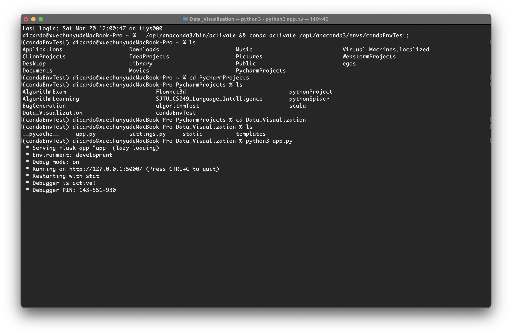

# 数据可视化作业四：网站前后端基础

---------------

## 1. Flask基础知识

### 1.1 简介

​	[Flask: 微型Python框架 开源软件](https://www.oschina.net/p/flask?hmsr=aladdin1e1)

- Flask是一个**微型的Python开发的Web后端框架**，其 [WSGI](https://baike.baidu.com/item/WSGI) 工具箱采用 Werkzeug ，[模板引擎](https://baike.baidu.com/item/模板引擎/907667)则使用 Jinja2 。Flask使用 BSD 授权。Flask也被称为 “**microframework**” ，因为它使用简单的核心，用 extension 增加其他功能。Flask没有默认使用的数据库、窗体验证工具。

---------

### 1.2 示例

[Flask中文官方文档](http://docs.jinkan.org/docs/flask/quickstart.html#a-minimal-application)

[Flask之解读app.py文件](https://blog.csdn.net/weixin_44733660/article/details/103876868) 

- 最简单的Flask应用：

  ```
  from flask import Flask
  app = Flask(__name__)
  
  @app.route('/')
  def hello_world():
      return 'Hello World!'
  
  if __name__ == '__main__':
      app.run()
  ```

  启动：

  ```
  $ python hello.py
  * Running on http://127.0.0.1:5000/
  ```

  - 首先，我们导入了 [`Flask`](http://docs.jinkan.org/docs/flask/api.html#flask.Flask) 类。这个类的实例将会是我们的 WSGI 应用程序。
  - 接下来，我们创建一个该类的**实例**，第一个参数是应用模块或者包的名称。 如果你使用单一的模块（如本例），你应该使用 `__name__ `，作用是：
    - 可以规定模版和静态文件的查找路径
    - 以后一些flask插件，如Flask-SQLAlchemy如果报错了，可通过`__name__`参数找到具体错误位置
  - 然后，我们使用 **@app.route()装饰器**告诉 Flask 什么样的URL 能触发我们的函数，**将url中 “/” 映射到hello_world这个视图函数上面**。**以后你访问我这个网站的 / 目录的时候 会执行hello_world这个函数，然后将这个函数的返回值返回给浏览器**
  - 这个函数的名字也在生成 URL 时被特定的函数采用，这个函数返回我们想要显示在用户浏览器中的信息。
  - 最后我们用 [`run()`](http://docs.jinkan.org/docs/flask/api.html#flask.Flask.run) 函数来让应用运行在本地服务器上。 其中 `if __name__ =='__main__':` 确保服务器只会在该脚本被 Python 解释器直接执行的时候才会运行，而不是作为模块导入的时候。

-----

### 1.3 render_template 模版渲染

[Flask 学着用模板 render_template](https://blog.csdn.net/yy19890521/article/details/81034765) 

- 模板的位置放在templates文件夹下面，一般是html文件，我们把index.html改动成如下样式：

```
<html>
  <head>
    <title>{{title}} - microblog</title>
  </head>
  <body>
      <h1>Hello, {{user.nickname}}!</h1>
  </body>
</html>
```

​	<font color=blue>注意</font>：**{{}}**表示这是一个变量，可以根据用户在模块端给予的参数的不同，进行调整

- 在调用**render_template**模版时，我们可以**根据在html文件中设置的变量，来进行参数的传递，从而进行模版渲染**。具体到上面的例子，即：

```
from flask import render_template
from app import app

@app.route('/')
@app.route('/index')
def index():
    user = {'nickname': 'Miguel'} 						# fake user
    return render_template("index.html", title = 'Home', user = user)     											#这里模块里的第一个user指的是html里面的变量user，而第二个user指的是函数index里面的变量user
```


-------


## 2. 实践过程中遇到的问题

- 注意：在运行demo的时候发现render_template函数无法找到templates目录下的index.html，原因是**没有将templates认证为templates目录，pycharm中右键该目录选择`mark this folder as templates`即可**。
- 在运行app.py时，发现并无网页窗口弹出，**需要点击输出中的网址 (Running on http://127.0.0.1:5000/) 才可进入正在运行后端程序的前端界面**，而不能直接点击打开html：

**IDE运行app.py**：


**命令行运行app.py**：

